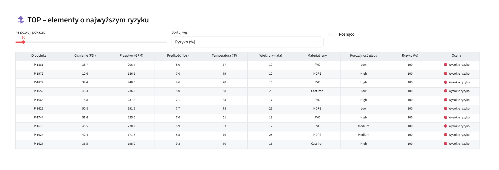

# AI – Predykcja awarii sieci wodno-kanalizacyjnej

Projekt prezentuje interaktywny dashboard Streamlit do oceny ryzyka awarii w sieciach wodno‑kanalizacyjnych z wykorzystaniem modeli uczenia maszynowego (Random Forest). Aplikacja umożliwia analizę danych, predykcję ryzyka, symulacje „co‑jeśli” oraz eksport raportu PDF.

## Kluczowe funkcje

- Klasyfikacja ryzyka awarii: niskie / średnie / wysokie
- Sandbox „co‑jeśli” (interaktywna symulacja)
- Wizualizacje wpływu cech na wynik modelu
- Eksport do PDF i CSV
- Live demo (opcjonalnie)

### Ustawienia + Podsumowanie ryzyka


### Czynniki wpływające na ryzyko


### Tryb „co‑jeśli” + Miernik ryzyka


### Tabela TOP elementów


## Technologie

- Python 3.10+
- Streamlit
- Scikit-learn (Random Forest)
- Plotly
- Pandas
- ReportLab (PDF)
- Kaleido (eksport wykresów do PNG)

## Uruchomienie

1. Zainstaluj zależności:

```bash
pip install -r requirements.txt
