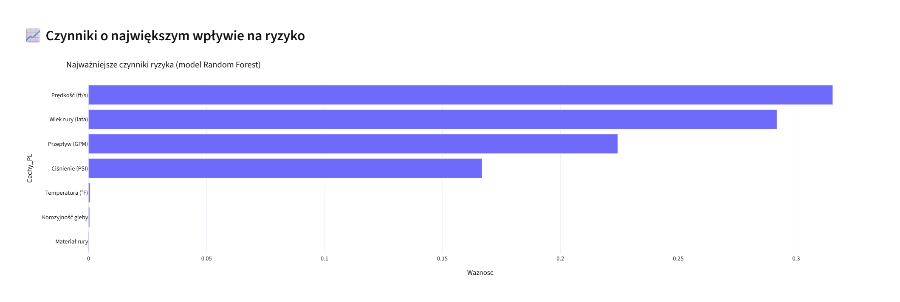

# 💧 AI – Predykcja awarii sieci wodno-kanalizacyjnej

Projekt prezentuje interaktywny dashboard Streamlit do oceny ryzyka awarii w sieciach wodno‑kanalizacyjnych z wykorzystaniem modeli uczenia maszynowego (Random Forest). Aplikacja umożliwia analizę danych, predykcję ryzyka, symulacje „co‑jeśli” oraz eksport raportu PDF.

## 🧠 Kluczowe funkcje

- Klasyfikacja ryzyka awarii: niskie / średnie / wysokie
- Sandbox „co‑jeśli” (interaktywna symulacja)
- Wizualizacje wpływu cech na wynik modelu
- Eksport do PDF i CSV
- Live demo (opcjonalnie)

## 📸 Zrzuty ekranu

### 🔧 Ustawienia + Podsumowanie ryzyka


### 📊 Czynniki wpływające na ryzyko


### 🧪 Tryb „co‑jeśli” + Miernik ryzyka


### 🔝 Tabela TOP elementów


> 📁 Umieść zrzuty ekranu w folderze: `assets/screens/`

## ⚙️ Technologie

- Python 3.10+
- Streamlit
- Scikit-learn (Random Forest)
- Plotly
- Pandas
- ReportLab (PDF)
- Kaleido (eksport wykresów do PNG)

## 🚀 Uruchomienie

1. Zainstaluj zależności:

```bash
pip install -r requirements.txt
